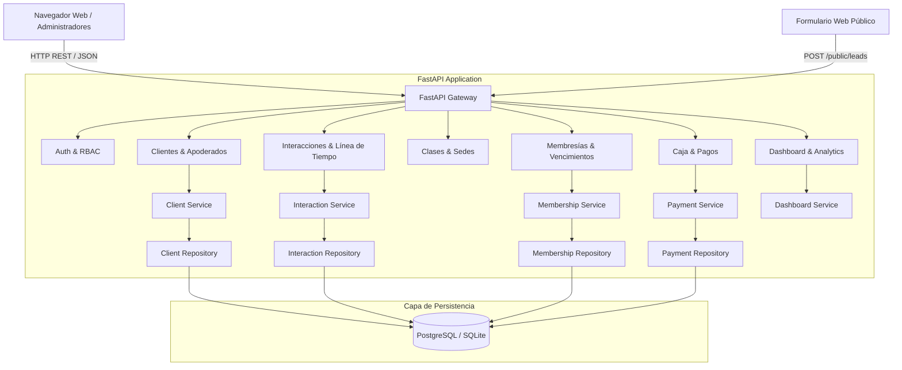

# Arquitectura del Sistema — GyS CRM

## 1. Visión General
GyS CRM está diseñado bajo una arquitectura limpia en capas (**Layered Architecture**) combinada con un backend modular en **FastAPI** y una interfaz de usuario **Single Page Application (SPA)** de alto rendimiento.

## 2. Capas de la Aplicación

### Capa de Presentación (Frontend SPA)
- Ubicada en `frontend/`.
- Construida con HTML5 semántico, CSS3 con tokens de diseño y JavaScript moderno modular sin dependencias pesadas.
- Gráficos analíticos renderizados en el cliente mediante Chart.js.
- Integración directa con el protocolo `https://wa.me/` para mensajería instantánea hacia alumnos y apoderados.

### Capa de API & Controladores (`backend/app/api/`)
- Mapea las rutas HTTP, valida las entradas mediante esquemas Pydantic y gestiona la inyección de dependencias de la sesión de base de datos (`Session`).

### Capa de Servicios (`backend/app/services/`)
- Contiene la lógica del negocio:
  - Detección automática de menores y validación de apoderados.
  - Generación de la **Línea de Tiempo 360°** del alumno (cronología de interacciones, clases, cobros y promociones).
  - Cálculo de vencimiento de mensualidades a 5 días.
  - Reglas de anulación de pagos con trazabilidad y auditoría.
  - Agregación estadística para el dashboard mensual y comparativa trimestral.

### Capa de Repositorios (`backend/app/repositories/`)
- Abstracción de acceso a datos utilizando SQLAlchemy 2.0.

### Capa de Modelos (`backend/app/models/`)
- Entidades relacionales mapeadas (`Client`, `ClassSession`, `Enrollment`, `Interaction`, `Membership`, `Payment`, `Promotion`, `ClientDiscount`, `User`, `AuditLog`).

## 3. Manejo de Sedes Múltiples (Multi-branch)
El sistema soporta 2 sedes operativas:
- **Los Olivos**
- **Comas**

Los administradores generales pueden visualizar métricas consolidadas de todas las sedes o filtrar por sede individual; los administradores de sede operan enfocados en su local asignado.
