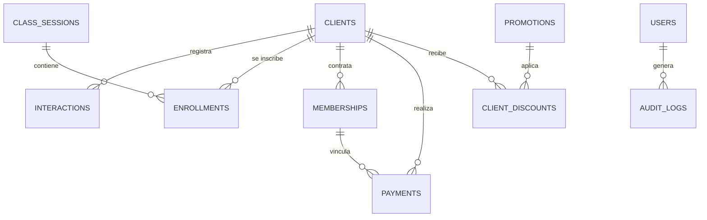

# Esquema de Base de Datos — GyS CRM

Diccionario de datos y modelo de relaciones para el Taller de Marinera Garbo & Salero.

## 1. Diagrama Entidad-Relación

## 2. Descripción de Tablas

### `clients` (Alumnos y Clientes)
| Columna | Tipo | Descripción |
|---|---|---|
| `id` | UUID (PK) | Identificador único del cliente |
| `first_name` | VARCHAR(100) | Nombres |
| `last_name` | VARCHAR(100) | Apellidos |
| `dni` | VARCHAR(8) (Unique) | DNI peruano de 8 dígitos |
| `phone` | VARCHAR(30) | Teléfono fijo o secundario |
| `whatsapp` | VARCHAR(30) | Número de WhatsApp para mensajería |
| `email` | VARCHAR(255) | Correo electrónico |
| `birth_year` | INT | Año de nacimiento |
| `is_minor` | BOOLEAN | Indica si es menor de 18 años (75% del alumnado) |
| `guardian_name` | VARCHAR(200) | Nombre del padre/madre/tutor responsable |
| `guardian_phone` | VARCHAR(30) | Teléfono del apoderado para grupos de WhatsApp |
| `guardian_relationship` | VARCHAR(50) | Parentesco (Madre, Padre, Tutor) |
| `guardian_dni` | VARCHAR(8) | DNI del apoderado |
| `preferred_branch` | VARCHAR(50) | Sede preferida (Los Olivos, Comas) |
| `status` | VARCHAR(20) | Estado: `interested`, `active`, `retired` |
| `acquisition_source` | VARCHAR(50) | Canal: `whatsapp`, `presencial`, `instagram`, `tiktok`, `referral`, `web` |
| `referrer_name` | VARCHAR(200) | Nombre de quién recomendó |
| `referrer_phone` | VARCHAR(30) | Teléfono de quién recomendó |
| `uninterested_reason` | VARCHAR(100) | Motivo de no inscripción (precio, horario, distancia) |
| `notes` | TEXT | Notas adicionales |
| `is_active` | BOOLEAN | Control de baja lógica |

### `interactions` (Historial de Contactos y Seguimiento)
| Columna | Tipo | Descripción |
|---|---|---|
| `id` | UUID (PK) | Identificador de la interacción |
| `client_id` | UUID (FK) | Cliente asociado |
| `interaction_date` | TIMESTAMPTZ | Fecha y hora del contacto |
| `channel` | VARCHAR(50) | `whatsapp`, `presencial`, `llamada`, `tiktok`, `instagram`, `web` |
| `motive` | VARCHAR(150) | `precios_y_horarios`, `visita_local`, `clase_prueba`, `particulares` |
| `summary` | TEXT | Resumen detallado de la conversación |
| `result` | VARCHAR(50) | `pidio_informacion`, `vino_a_probarse`, `se_inscribio`, `lo_pensara`, `no_respondio` |
| `uninterested_reason` | VARCHAR(100) | Motivo si no se inscribió |
| `attended_by` | VARCHAR(150) | Asesor o administrador que atendió |
| `next_followup_date` | TIMESTAMPTZ | Fecha pactada para volver a contactar |
| `reminder_active` | BOOLEAN | Indica si tiene recordatorio pendiente |

### `memberships` (Membresías y Ciclos Mensuales)
| Columna | Tipo | Descripción |
|---|---|---|
| `id` | UUID (PK) | Identificador de la membresía |
| `client_id` | UUID (FK) | Cliente titular |
| `branch` | VARCHAR(50) | Sede: `Los Olivos`, `Comas` |
| `class_type` | VARCHAR(50) | `grupal_mensual`, `clase_libre`, `particular_paquete` |
| `plan_name` | VARCHAR(150) | Nombre comercial del plan |
| `period_month` | VARCHAR(7) | Mes en formato `YYYY-MM` |
| `start_date` | DATE | Fecha de inicio del ciclo |
| `end_date` | DATE | Fecha de fin/vencimiento |
| `classes_total` | INT | Total de clases (8 para mensualidad) |
| `classes_attended` | INT | Clases consumidas/asistidas |
| `price` | NUMERIC(10,2) | Precio base del plan |
| `discount_applied` | NUMERIC(10,2) | Descuento aplicado |
| `final_price` | NUMERIC(10,2) | Monto final a pagar |
| `payment_status` | VARCHAR(30) | `paid`, `pending`, `partial` |
| `status` | VARCHAR(30) | `active`, `expiring_soon`, `expired`, `cancelled` |

### `payments` (Transacciones de Caja)
| Columna | Tipo | Descripción |
|---|---|---|
| `id` | UUID (PK) | Identificador del pago |
| `client_id` | UUID (FK) | Alumno que paga |
| `membership_id` | UUID (FK) | Membresía vinculada (opcional) |
| `amount` | NUMERIC(10,2) | Monto cobrado en Soles (S/) |
| `payment_date` | TIMESTAMPTZ | Fecha y hora del cobro |
| `period_month` | VARCHAR(7) | Mes del cobro (`YYYY-MM`) |
| `concept` | VARCHAR(100) | `mensualidad`, `matricula`, `clase_libre`, `paquete_particular` |
| `shift_detail` | VARCHAR(100) | Turno / Horario registrado |
| `payment_method` | VARCHAR(30) | `efectivo`, `yape`, `plin`, `transferencia` |
| `transaction_reference` | VARCHAR(100) | N° de operación bancaria o de billetera digital |
| `branch` | VARCHAR(50) | Sede receptora del dinero |
| `registered_by` | VARCHAR(150) | Usuario que registró el cobro |
| `status` | VARCHAR(30) | `completed`, `cancelled`, `refunded` |
| `cancellation_reason` | TEXT | Motivo de anulación (requerido para cancelaciones) |
| `cancelled_by` | VARCHAR(150) | Administrador General que autorizó la anulación |
| `cancelled_at` | TIMESTAMPTZ | Fecha y hora de la anulación |

### `promotions` & `client_discounts`
- `promotions`: Catálogo maestro de descuentos (`fixed_amount`, `percentage`, `enrollment_fee_waiver`).
- `client_discounts`: Registro inmutable con trazabilidad de qué cliente recibió qué beneficio, motivo y quién lo autorizó.
